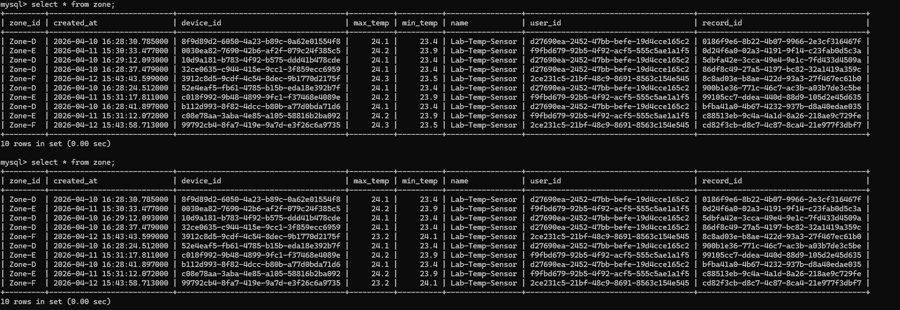
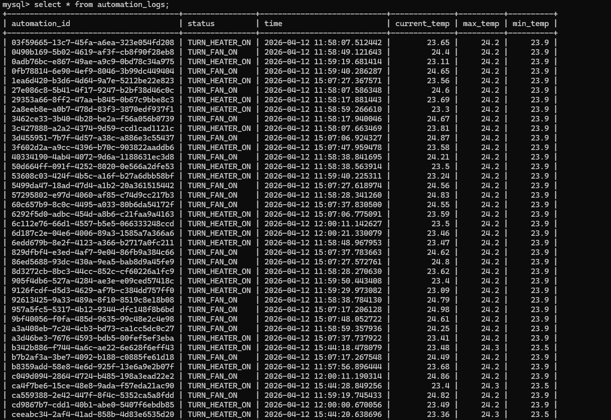
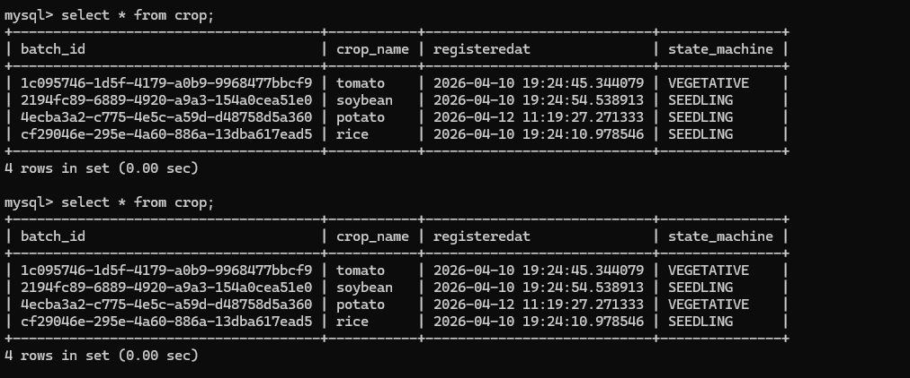
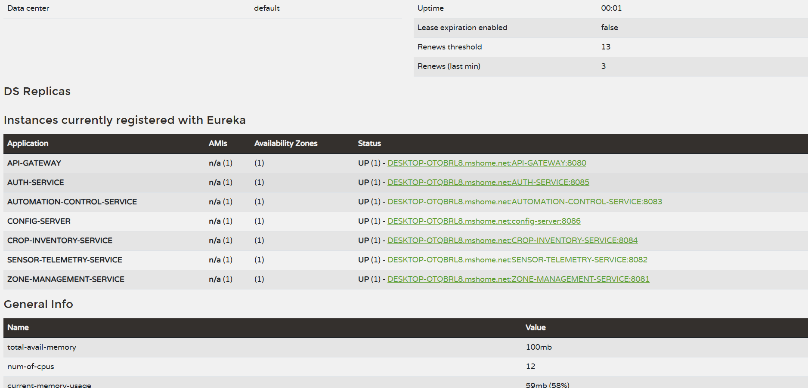
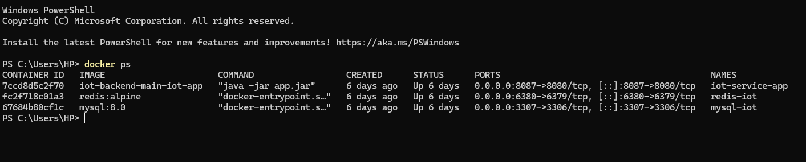

# AD2 Microservices Project

This project contains multiple microservices developed for the AD2 course work

# Smart Agriculture Microservices System

---

## Overview

This project is a microservices-based backend system designed for smart agriculture automation. It manages zones, sensors, environmental data, and crop inventory while automating device control such as heaters and fans based on real-time data.

The system is divided into:
- Infrastructure Services
- Domain Microservices

---

## Architecture

---

## Infrastructure Services

| Service | Port | Description |
|--------|------|------------|
| Service Registry (Eureka) | 8761 | Service discovery |
| API Gateway | 8080 | Request routing and JWT validation |
| Config Server | 8086 | Centralized configuration |

---

## Domain Microservices

| Service | Port | Description |
|--------|------|------------|
| Auth Service | 8085 | Authentication and authorization |
| Zone Management Service | 8081 | Zone and device management |
| Sensor Telemetry Service | 8082 | Fetch sensor data |
| Automation Control Service | 8083 | Decision engine |
| Crop Inventory Service | — | Crop lifecycle management |

---

## Microservices Description

### Zone Management Service (Port: 8081)

Responsible for registering zones and devices with an external IoT server and storing metadata.

**Features**
- Register zones and devices
- Update min/max temperature
- Fetch zone details
- Delete zones

**Database**
- Database: `zone_service_db`
- Table: `zone`
- Fields: `zone_id`, `device_id`, `name`, `min_temp`, `max_temp`

**zone_db_service**

---

### Sensor Telemetry Service (Port: 8082)

Fetches real-time temperature and humidity data from the external IoT server.

**Workflow**
1. Fetch registered devices
2. Retrieve sensor values using device IDs
3. Send data to Automation Control Service

**Execution**
- Runs every 10 seconds

---

### Automation Control Service (Port: 8083)

Acts as the decision-making engine of the system.

**Responsibilities**
- Process telemetry data
- Compare with zone thresholds
- Control heater and fan

**Endpoints**
- `POST /api/automation/process`
- `GET /logs`

**Automation Logs**

---

### Crop Inventory Service

Manages crop batches and lifecycle stages.

**Features**
- Register crop batches
- Update lifecycle stages:
    - SEEDLING
    - VEGETATIVE
    - HARVESTED
- View crop inventory

**Screenshots**

[//]: # (![Crop Lifecycle]&#40;./screenshots/crop-lifecycle.png&#41;)

[//]: # (![Crop Inventory]&#40;./screenshots/crop-inventory.png&#41;)

---

### Auth Service (Port: 8085)

Handles authentication and authorization.

**Features**
- User registration
- Login
- JWT-based authentication

**System Behavior**
- After login:
    - Sensor Telemetry Service starts scheduled execution
    - Automation process begins

---

## Config Server

Centralized configuration management using a GitHub repository.

**Github Repository**
[Centralized Configuration Repository](https://github.com/thambe96/ad2-application-config)

---
## Eureka Server

## External IoT Server

- Runs using Docker on Port 8087

---

**IoT backend**

---

## System Workflow

1. User logs in via Auth Service
2. Sensor Telemetry Service starts scheduled data fetching
3. Data is sent to Automation Control Service
4. Automation decisions are made based on thresholds
5. Devices (heater/fan) are controlled
6. Crop and zone data are managed via respective services

---

## Tech Stack

- Backend: Spring Boot (Microservices)
- HTTP Client: OpenFeign (Internal Communication between microservices and external communication)
- Database: MySQL
- Service Discovery: Eureka
- API Gateway: Spring Cloud Gateway
- Configuration: Spring Cloud Config
- Authentication: JWT
- Containerization: Docker

---

## Getting Started

### Prerequisites

- Java 17+
- Maven
- MySQL
- Docker

---

## Startup Order

Start services in the following order:

1. Config Server (8086)
2. Service Registry (8761)
3. API Gateway (8080)
4. Auth Service (8085)
5. Zone Management Service (8081)
6. Sensor Telemetry Service (8082)
7. Automation Control Service (8083)
8. Crop Inventory Service

---

## Notes

- Ensure MySQL is running and databases are configured
- Config Server must be connected to the repository
- IoT server must be running before telemetry service starts

---

